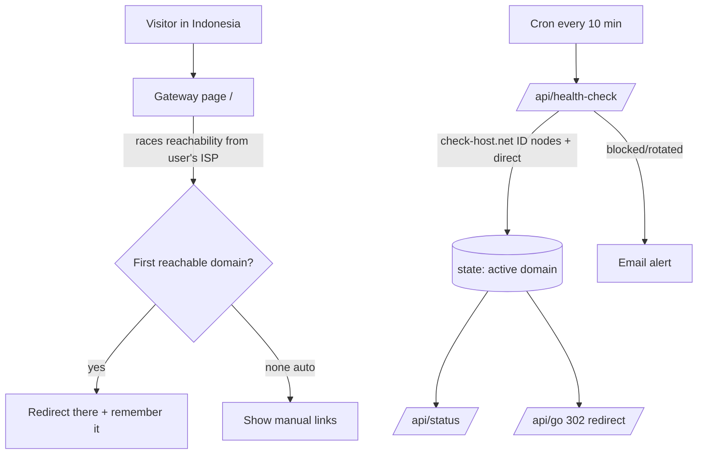

# Global Rotate — auto domain rotator for Indonesia blocking

Automatically send visitors to a **working mirror domain** when your primary
domain gets blocked by Indonesian ISPs (Kominfo / TrustPositif / Nawala).

It combines two detection layers so it keeps working even when one fails:

| Layer | Where it runs | Detects |
|-------|---------------|---------|
| **Client gateway** (`public/index.html`) | The visitor's **real Indonesian browser/ISP** | ISP-level blocking of the actual user — most reliable |
| **Server monitor** (`api/health-check`, cron) | Vercel | Dead deploys + blocking seen from Indonesian check-host.net nodes; updates the "active" pointer and emails alerts |

## How it works



- **Stable entry points** you advertise (ads, QR, safe link):
  - `https://<project>.vercel.app/` → smart client-side gateway
  - `https://<project>.vercel.app/api/go` → instant server 302 to the active domain
- Both always resolve to a currently-working mirror.

## Quick start

1. **Install Vercel CLI & login**
   ```powershell
   npm i -g vercel
   vercel login
   ```

2. **Set your domains.** Edit the pool in two places (kept simple on purpose):
   - [lib/domains.js](lib/domains.js) — server pool (or set `DOMAINS` env var)
   - `CANDIDATES` array in [public/index.html](public/index.html) — client pool

3. **Test locally**
   ```powershell
   node scripts/check.js
   ```

4. **Deploy**
   ```powershell
   vercel --prod
   ```

## Configuration (Vercel → Settings → Environment Variables)

Copy [.env.example](.env.example). All optional except your domains.

| Var | Purpose |
|-----|---------|
| `DOMAINS` | Comma-separated pool, priority order. Overrides `lib/domains.js` without a redeploy. |
| `UPSTASH_REDIS_REST_URL` / `UPSTASH_REDIS_REST_TOKEN` | Persist the active-domain pointer across cron runs (free tier: upstash.com). Without it, state is in-memory only. |
| `RESEND_API_KEY`, `ALERT_FROM`, `ALERT_TO` | Email alert when a domain is blocked or the active one rotates (free tier: resend.com). |

The cron schedule (`*/10 * * * *` = every 10 min) is in [vercel.json](vercel.json).

## Endpoints

| Route | Description |
|-------|-------------|
| `GET /` | Client gateway: tests domains from the user's ISP, redirects to the first reachable one. |
| `GET /api/go` | Server 302 redirect to the last-known-active domain (forwards query string). |
| `GET /api/status` | JSON of the current active domain + per-domain status. |
| `GET /api/health-check` | Runs the full check + rotation (also invoked by cron). |

## Manage the pool from Google Sheets (optional)

[apps-script/Code.gs](apps-script/Code.gs) is an upgraded version of your original
UltraDomainVercel helper. Paste it into the Sheet's Apps Script editor to let
teammates add/block mirrors from a menu, then use **Ultra Rotator → Copy DOMAINS
env value** and paste it into the Vercel `DOMAINS` variable.

## Notes & limits

- check-host.net Indonesian nodes are best-effort and rate-limited; when the
  Indonesia check is inconclusive the server falls back to direct reachability.
  The **client gateway is the authoritative detector** for real ISP blocking.
- Keep the two domain lists in sync (server + client). `DOMAINS` env is the
  easiest single source of truth for the server; the client can also pull the
  live order from `/api/status`.
- Use this only for domains/services you are authorized to operate.
